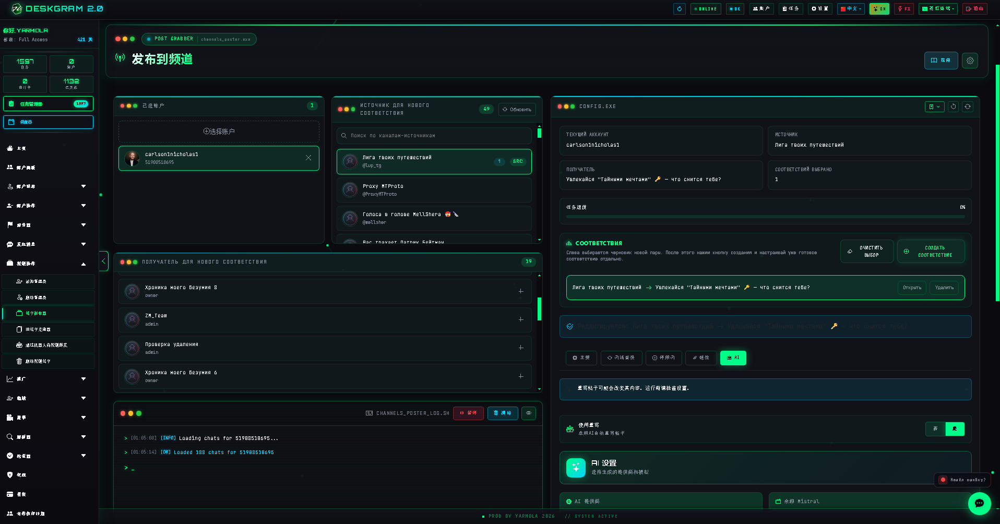
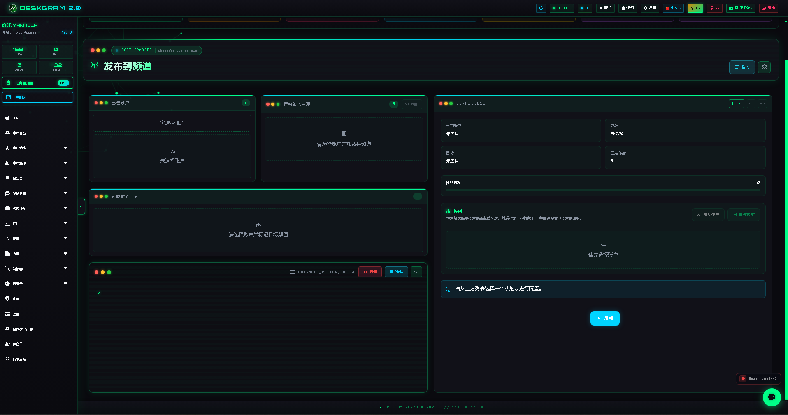
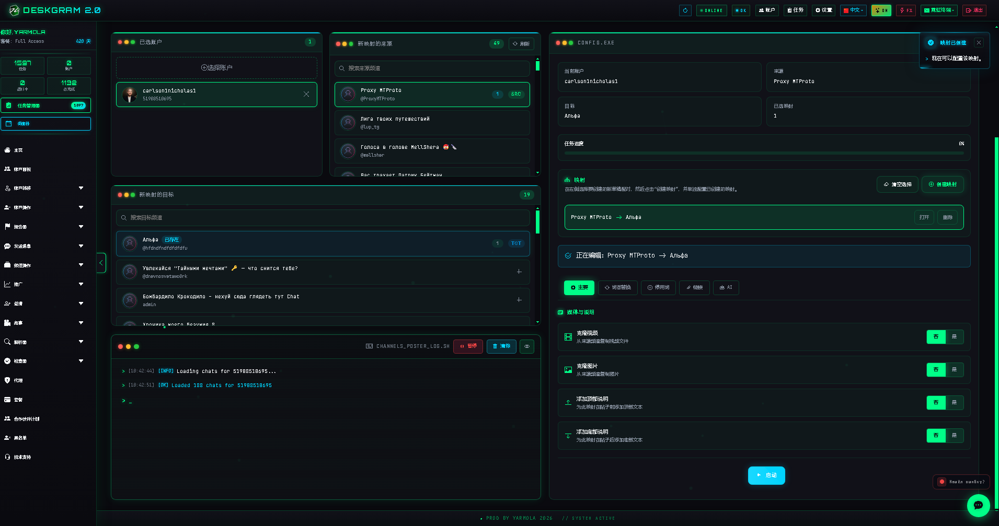
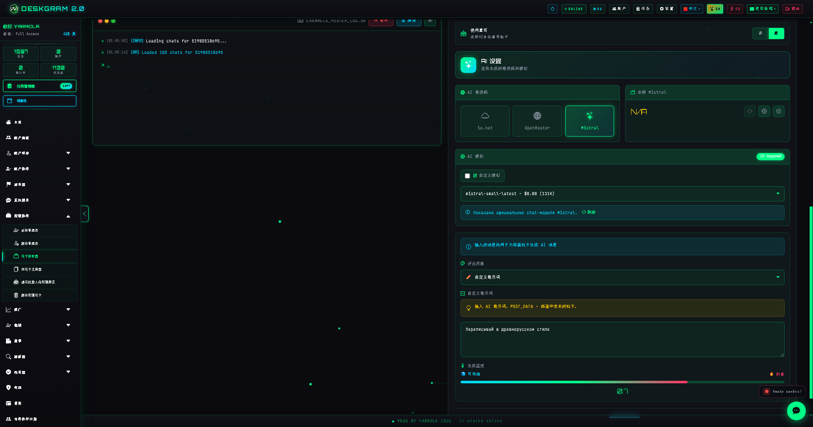

# Deskgram 2 帖子抓取器

Deskgram 2 的帖子抓取器用于从 Telegram 频道抓取内容，并通过来源-目标映射重新组装新的发布路线。它适合那些不仅想复用内容，还需要控制媒体、顶部/底部文本、替换规则、链接规则和 AI 改写的场景。

[Deskgram 2 Hub](https://github.com/Deskgram-2/deskgram-2-telegram-automation-zh) · [Website](https://deskgram2.com/) · [Telegram Bot](https://t.me/DG2welcomebot) · [Web Preview](https://deskgram2.com/web-preview?path=%2Fapp-demo%2F&lang=cn)

## 交互式 Web Preview

浏览器中查看模块界面：[打开 web preview](https://deskgram2.com/web-preview?path=%2Fapp-demo%2Ffunctions%2Fchannel_poster&lang=cn)

在真正搭建内容抓取路线之前，可以先看映射列表、媒体选项和 AI 配置。

## Screenshots

## 模块概览

| 参数 | 内容 |
|---|---|
| 核心任务 | 在频道之间抓取并重组 Telegram 帖子 |
| 关键模块 | 映射、媒体设置、顶部/底部文本、替换、链接、AI |
| 适用场景 | 内容网络、内容重打包、适应不同频道 |
| 相关模块 | 旧帖子克隆器、任务管理、设置 |

## 模块能力

- 构建 source -> target 内容路线；
- 按规则复制图片和视频；
- 在正文上方或下方附加文本；
- 应用替换、停用词、链接设置和 AI 改写；
- 在一个 сценарий 里保存多个可配置映射。

## 快速开始

1. 选择账号并刷新频道列表。
2. 创建第一个 source -> target 映射。
3. 配置媒体规则、文本附加、替换和链接。
4. 如有需要，开启 AI 改写。
5. 启动模块并通过日志查看结果。

## FAQ

### 可以先看界面再决定吗？

可以，上面的浏览器预览链接已经可以直接打开模块。

### 这个模块只是把文本搬过去吗？

不是。它更适合在抓取基础上重新打包内容，而不是单纯复制。
